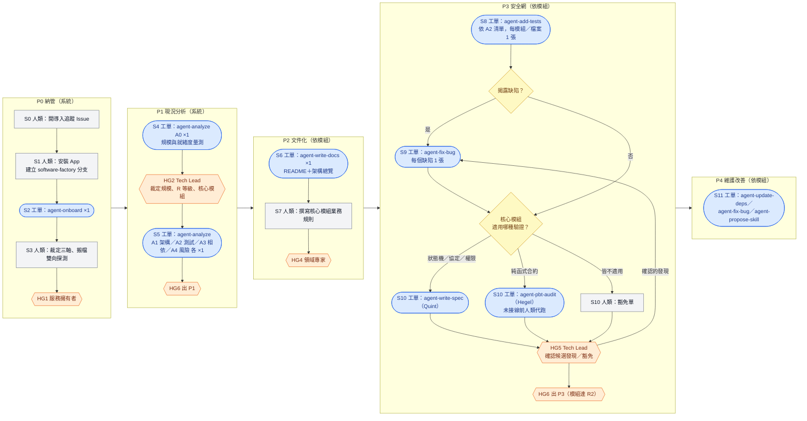
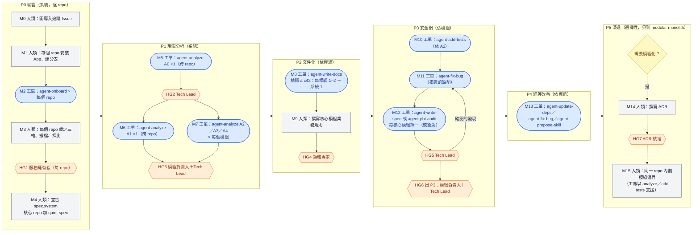
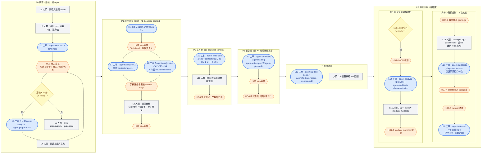

# 29 — 棕地系統導入 Playbook（規模分級 × 就緒度 × 工作項流程）

> **依據**：`06`（監督三軸與 in-loop）、`07`（拆分規則）、`21`（工作類型與紅線）、`27`（納管流程）、`28`（write-spec 操作）、`ADR-008`（獨立性）、`ADR-013`（trunk 統一）、`ADR-018`（write-spec）、`ADR-019`（PBT／Hegel）；外部研究見 §14。
> **讀者**：要把一個**既有系統**（棕地，brownfield）導入軟體工廠的人——服務擁有者、Tech Lead、審查者。
> **狀態**：設計文件（2026-10-05 經使用者逐題裁決，裁決索引見附錄 A）。**本文件只定義流程，不改任何機制**；需要機制支援的項目列於 §13。所有門檻皆為**暫定、待校準**（docs/10 Q29-1～Q29-3）。

---

## 1. 目的與範圍

棕地系統的本質是「**先理解、再釘住、才敢改**」。本文件回答五個問題：

1. 如何把一個既有系統判定為**小型／中型／大型**（§4）？
2. 「開立 Factory 工作項」有哪些類型、各能做什麼（§3）？
3. 這些類型如何對應到軟體工程的開發流程（§3.3、§6）？
4. 不同規模的專案，工作項要依什麼順序、經過哪些**人類把關**（§8、§9）？
5. 未拆分的大型單體，何時、如何拆成多個 repo（§11）？

**分級對象有兩層**：一個「系統」可能是單一 repo（含未拆分的單體），也可能跨多個 repo／服務（Backstage 的 `System`）。規模以**系統**為單位裁定，納管與工作項以 **repo** 為單位執行（§4.3）。

### 1.1 三條不可違反的前提

| # | 前提 | 出處 |
|---|---|---|
| 1 | **規模分級與監督計分正交**：規模只決定「跑哪些階段、開幾張單、要過哪些閘門」，**不放寬任何 agent 權限**。agent 能不能實作，仍完全由三軸計分（`06` §4）決定 | `06` §5.2（`task_type` 不進計分的同一原則：被判定者不參與判定） |
| 2 | **每一張工作項都由人類開立並送出**（Backstage 送出即核准），agent 報告中的「建議下一步」**不會自動變成工作項** | `03` §3.4、`07` §2.3 |
| 3 | **agent 不得修改 guardrail 本身**：`catalog-info.yaml`、`.github/**`、`CODEOWNERS`、`.dsh/skills/**` 一律由人類處理 | `05` §1.1、`27` §14 |

---

## 2. 名詞

| 用語 | 定義 |
|---|---|
| **工作項**（俗稱工單） | 一個 GitHub Issue，經「開立 Factory 工作項」或 issue form 建立，由 `factory-run.yml` 派工（GLOSSARY §1） |
| **規模等級** | 小型／中型／大型。依 §4 的六個維度裁定，以**系統**為單位 |
| **就緒度** | R0／R1／R2。依 §5 判定，以**模組**為單位；決定該模組現在允許開哪些類型 |
| **階段** | P0 納管 → P1 現況分析 → P2 文件化 → P3 安全網 → P4 維護改善 → P5 演進（§6） |
| **人類閘門（HG0–HG7）** | 必須由具名人類簽核的關卡（§8）。**HG 與 `risk-paths.yml` 的 H1–H7 無關**，請勿混淆 |
| **驗證閘門** | P3 的出口條件：核心模組須通過 Quint 或 Hegel 驗證，或經人類簽核豁免（§10） |
| **核心模組** | 命中 H1／H2／H4 路徑，或被 A4 報告標為風險熱點的模組 |
| **導入追蹤 Issue** | 每個系統一張的**普通 Issue**（不加 `[factory]` 前綴、不派工），以勾選清單記錄所有 HG 的簽核人、日期與證據連結 |
| **標準分析單 A0–A4** | 五種固定題目的 `agent-analyze` 工作項（§7） |

---

## 3. 「開立 Factory 工作項」的所有類型

### 3.1 表單內的 7 種類型（`backstage/templates/factory-work-item/template.yaml`）

| 類型 | 做什麼 | 產出位置 | PR 形態 | in-loop（5–6 分）可否執行 | 實跑狀態 |
|---|---|---|---|---|---|
| **`agent-analyze`** | 分析／調查：bug 重現、根因、影響範圍、可行性。**不產生任何程式碼變更** | `docs/research/<issue>-<主題>.md`，必含：結論摘要、證據與根因、影響範圍、方案比較（含被拒方案）、建議下一步 | 單層 | ✅ 可（僅分析模式） | ✅ 已驗證（#227＋T1/T2/T3） |
| **`agent-write-docs`** | 撰寫文件；**必須與實作一致**，不得描述不存在的行為 | `docs/` 等文件路徑 | 通常單層；多個獨立主題才拆 | ❌ 被擋 | ⚠️ 從未實跑 |
| **`agent-add-tests`** | 為**既有行為**補測試；新測試必須在既有實作上直接綠燈。揭露缺陷時以 `it.skip` 交付並建議另開 fix-bug，**不得改實作** | 測試檔 | 單層（只有 01-test） | ❌ 被擋 | ✅ 已驗證（試點 #2） |
| **`agent-fix-bug`** | 修 bug：先寫重現失敗的測試（修前紅、修後綠），再修復 | 測試＋實作＋文件 | 三層 stack：01-test → 02-impl → 03-docs | ❌ 被擋 | ✅ 已驗證（試點 #3） |
| **`agent-update-deps`** | 升級套件並確認無回歸；**未經人類核可不得新增套件**（SR5） | lockfile／manifest | 通常單一 PR（`07` §2.3） | ❌ 被擋 | ⚠️ 從未實跑 |
| **`agent-write-spec`** | Quint 可執行規格。**一張 Issue、兩個 run**：先寫不變量（只能出自規格來源），經人類貼 `spec/approved` 後，才依程式碼現況寫模型並做模型檢查。**不改 `src/`**；反例是「候選發現」 | `specs/<name>/`（`invariants.qnt`、`source.md`、`model.qnt`、`instances.qnt`、`verify.yml`） | 單層 ×2 | ❌ 被擋 | ⚠️ 唯一一次實跑逾時；ADR-018 改版已實作（#315–#320），驗收試點待執行 |
| **`agent-propose-skill`** | 為 repo 專屬經驗撰寫技能**草案**；須人類執行 `factory-skills-lock --promote` 才生效 | `proposals/skills/<name>/SKILL.md` | 單層 | ✅ 可 | ⚠️ 從未實跑 |

> **write-spec 的額外條件**：開單時必填「規格名稱」「規格來源」；且 Issue 宣告的目標路徑須命中 H 規則，**或**目標 repo 的 `catalog-info.yaml` 有 `factory.io/quint-spec` 標註，否則不派工（`ADR-018` §4、`28`）。write-spec 類型層級**禁止自動合併**。
>
> in-loop 可執行的類型以 `src/cli/apply-score-labels.ts` 的 `OUTPUT_ONLY_TASK_TYPES` 為單一真相來源（目前為 analyze 與 propose-skill）。

### 3.2 表單外的 2 種類型

| 類型 | 說明 | 狀態 |
|---|---|---|
| **`agent-onboard`** | 納管：唯讀掃描目標 repo，產出 `proposals/onboarding/` 下的三軸建議（值一律 `TODO`）、`risk-paths.yml` 草稿與審查說明。**不走 `factory-run.yml`**，而是 `factory-onboard.yml`；入口為 GitHub issue form 或 gh CLI，**Backstage 表單沒有這一型**（`27` §12） | ✅ 已驗證（`camunda_hazelcast`） |
| **`agent-pbt-audit`** | 以 Hegel（PBT）稽核一個模組：只改測試檔；通過的 property 進 PR，失敗的寫成「候選發現（未回放）」留言；試行期一律人類審查。人類手動開單並貼 `pbt/audit` 標籤 | ⚠️ **ADR-019 已接受，尚未接線**。本 playbook 將其列為驗證閘門的必要類型（§10），接線前由人類手動執行 Hegel 代行 |

> 本 playbook 以**現有類型**為主（附錄 A Q7），`agent-pbt-audit` 是唯一例外。候選類型 `agent-refactor`、`agent-security-fix`、`agent-migrate`、`agent-release-notes`（`21` §2）在流程中保留位置，標示「**尚未接線，目前由人類執行**」；紅線類型（`21` §3，如 `agent-architect-decision`、`agent-ci-fix`）永不派給工廠。

### 3.3 類型與軟體工程活動的對應

| 軟體工程活動 | 使用的類型 | 本 playbook 階段 | 價值流（`01`） |
|---|---|---|---|
| 納管、權限與風險設定 | `agent-onboard` ＋ 人類裁定 | P0 | Configure |
| 現況理解、需求與架構盤點、可行性 | `agent-analyze`（A0–A4） | P1 | Plan |
| 系統文件、架構文件 | `agent-write-docs` | P2 | Plan／Create |
| 業務規則（需求）撰寫 | **人類**（工廠不做） | P2 | Plan |
| 回歸安全網（characterization tests） | `agent-add-tests` | P3 | Verify |
| 形式化驗證（狀態機、協定、權限） | `agent-write-spec`（Quint） | P3 | Verify |
| 性質測試（純函式合約） | `agent-pbt-audit`（Hegel） | P3 | Verify |
| 缺陷修復 | `agent-fix-bug` | P3、P4 | Create |
| 相依維護、安全更新 | `agent-update-deps` | P4 | Create／Release |
| 工具與知識累積 | `agent-propose-skill` | P4 | Operate |
| 新功能、重構、遷移 | **人類**（現有類型無法實作功能或重構） | P4、P5 | Create |
| 架構決策（ADR） | **人類**（紅線） | P5 | Plan |

### 3.4 複雜架構能否用軟體工廠自動化？

**結論：工廠能自動化「理解、安全網、驗證」三類工作；「決策」與「結構性搬移」不能。** 這是 repo 的治理規則決定的，不是模型能力的問題。

| 架構工作 | 工廠能否做 | 依據 |
|---|---|---|
| 現況盤點、相依圖、接縫（seam）辨識、拆分方案比較 | ✅ `agent-analyze`；in-loop 也可 | analyze carve-out（`06` §4） |
| as-is 架構與模組文件 | ✅ `agent-write-docs`（非 in-loop） | 須與實作一致 |
| 拆分前以 characterization tests 釘住行為 | ✅ `agent-add-tests` | 只補測試，不改實作 |
| 關鍵協定、狀態機的形式化不變量 | ⚠️ `agent-write-spec` | 驗收試點待執行 |
| **決定目標架構、做 ADR 裁決** | ❌ 紅線 `agent-architect-decision` | `21` §3、`06` §4.3 |
| **重構或搬移程式碼以拆模組** | ❌ 無對應類型（refactor／migrate 仍為候選）；共用模組命中 H4 | `21` §2.2、§2.4 |
| **建立新 repo、CI、分支保護** | ❌ App 無 Workflows／Administration 權限，寫 `.github/**` 被 GitHub 以 403 拒絕 | `27` §14 |
| DB schema 拆分、對外 API 破壞性變更 | ❌ 命中 H6／H7，一律至少人類審查 | `06` §3.2 |

**已知缺口**：現有 7 型中**沒有任何一型能實作新功能或重構**（fix-bug 只修 bug，add-tests 不改實作）。因此單體拆分（§11）的「動手」部分一律由人類執行；工廠負責拆分前的分析、測試與文件，拆分中對人類 PR 的驗證支援（add-tests、write-spec），以及拆分後對每個新 repo 重新納管。

---

## 4. 規模分級標準

### 4.1 六個維度

> [S]＝有來源直接支持；[E]＝外推；[S→E]＝來源數字經換算或轉用。**全部為暫定值，待本 playbook 試點後校準（docs/10 Q29-1）。**

| 維度 | 小型 | 中型 | 大型 | 依據 |
|---|---|---|---|---|
| **正式程式碼 KLOC**（依 CAST Application Size：不含空行、測試、產生的程式碼、設定與文件） | < 50 | 50–500 | > 500 | [S→E] Jones：agile 很少用在 > 1,000 FP 的系統；> 10,000 FP 的專案超過一半被取消或延遲一年以上。QSM：Java 53、C# 54、JavaScript 47 SLOC/FP → 1,000 FP ≈ 50 KLOC、10,000 FP ≈ 500 KLOC |
| **可部署單元數**（服務、批次、前端各算一個） | 1–3 | 4–10 | ≥ 11 | [S→E] AWS Application Portfolio Assessment 對 compute instances 的分組 1–3／4–10／11+，轉用到部署單元 |
| **外部整合數**（呼叫或被呼叫的外部系統、第三方 API、訊息佇列主題） | 0–3 | 4–10 | ≥ 11 | [S] 同一份 AWS 指南：dependencies 0–3／4–10／11+，並建議試點選 0–3 個依賴的應用 |
| **負責團隊數** | 1 | 2–3 | ≥ 4 或跨部門 | [S→E] Conway's law、Team Topologies（cognitive load）、two-pizza teams；COCOMO organic 模式 32 KDSI 約需 6.5 人，相當於一個團隊 |
| **repo 數／模組（bounded context）數** | 1 repo、≤ 5 模組 | 1–5 repo、5–15 模組 | > 5 repo 或 > 15 模組 | [E] 無權威數字；來源只把 bounded context 當作拆分單位（Fowler、Azure） |
| **DB 資料表數** | < 50 | 50–300 | > 300，或與其他系統共用 DB | [E] 無權威數字；AWS 將 database complexity 列為複雜度因子，共用 DB 是 Newman 指出的拆分主要障礙 |

**與 agent 能力的關係**：SWE-bench 的 repo 平均 438K 行、最大 886K 行；METR 在平均 1M+ LOC 的成熟 repo 上觀察到（2025 年初的）AI 工具讓資深開發者變慢 19%（METR 已註明結果過時）；LongCodeBench 與 Chroma 的 context rot 研究都顯示長 context 會使效果退化。**約 500 KLOC 是 benchmark 驗證過的上緣**，與大型門檻一致。這也是大型專案「每張 analyze 單只處理一個 bounded context」（§7.2）的理由。

**已知缺口**：Python 與 TypeScript 沒有權威的 LOC/FP 換算值（QSM 表未收錄），這兩種語言的 KLOC 門檻屬外推，須以自家專案校準。

### 4.2 合併規則

1. **至少 2 個維度達到某一級，才定為該級**；否則取次一級。範例：一個用到 12 個外部 API、但只有 8 KLOC、1 個團隊的小工具，只有 1 個維度達大型 → 不定為大型（再看中型是否有 2 個維度達標）。
2. **人類只能往上調，不能往下調**（與三軸 fail-safe 同一個單向棘輪精神）。往上調須在導入追蹤 Issue 寫明理由。
3. **由 agent 量測、人類裁定**：A0 報告提供六個維度的數值與量測方法（§7.1），規模等級在 HG2 由人類簽核。agent 的建議值不具效力。

### 4.3 多 repo 系統

- 系統的六個維度以**全部 repo 合計**計算，得出一個規模等級，**系統內所有 repo 套用同一等級的階段流程**。
- 就緒度（§5）仍**逐 repo、逐模組**評定。
- 系統歸屬由人類在各 repo 的 `catalog-info.yaml` 以 `spec.system` 宣告（HG1 時一併處理）。

---

## 5. 就緒度（以模組為單位）

規模決定「要跑哪些階段、分析範圍多大」；**就緒度決定「這個模組現在允許開哪些工作項、可以開多少」**。工作節奏取決於系統完整程度與測試覆蓋程度，與專案大小、審查人數無關。

| 等級 | 判準（皆可機械驗證） | 允許的工作項類型 | 並行數 |
|---|---|---|---|
| **R0** | 無法重現建置，**或**沒有自動化測試，**或**沒有 CI | analyze、write-docs、add-tests（＋in-loop 規則下的 propose-skill） | 不設上限 |
| **R1** | 可重現建置、CI 綠燈，但該模組**行覆蓋率 < 60%** | R0 的類型，再加 fix-bug（**只限已有測試覆蓋的路徑**）、update-deps（**只限有已知 CVE 者**） | 不設上限 |
| **R2** | 可重現建置、CI 綠燈，且行覆蓋率 **≥ 60%** | 全部類型 | 不設上限 |

- **「系統完整程度」以三項機械判定**：可重現建置、有 CI、有自動化測試。
- **覆蓋率門檻出處** [S]：Google Testing Blog〈Code Coverage Best Practices〉（2020-08-07）：「at Google we offer the general guidelines of 60% as "acceptable", 75% as "commendable" and 90% as "exemplary"」。本 playbook 以 60% 作為 R2 下限，75% 為建議目標。同文亦強調覆蓋率不代表測試品質——低覆蓋保證有未測區域，高覆蓋不保證測試有效，故 R2 不取代 §10 的驗證閘門。門檻是否適用於本組織待校準（docs/10 Q29-2）。
- 就緒度在 HG2 由人類依 A0／A2 證據簽核；之後每次模組出 P3 時重新評定。
- **目前的執行方式**：上表的「允許類型」**沒有機械強制**，由開單者在 HG0 自律、審查者把關；機械化列為 §13 後續工作項。

---

## 6. 階段骨架 P0–P5

```
           系統為單位                          模組為單位（各模組各自推進）                 選擇性
┌───────────┐   ┌──────────────┐   ┌────────────┐   ┌────────────────┐   ┌──────────┐   ┌──────────┐
│ P0 納管    │ → │ P1 現況分析   │ → │ P2 文件化   │ → │ P3 安全網       │ → │ P4 維護改善│   │ P5 演進   │
│ onboard    │   │ A0 → A1–A4   │   │ write-docs │   │ add-tests      │   │ update-deps│   │ 人類拆分  │
│            │   │              │   │ ＋人類業務規則│   │ fix-bug        │   │ fix-bug    │   │ 新 repo   │
│            │   │              │   │            │   │ 驗證閘門        │   │ propose-skill│ │ → 回 P0   │
└─────┬─────┘   └──────┬───────┘   └─────┬──────┘   └───────┬────────┘   └──────────┘   └──────────┘
    HG1             HG2＋HG6           HG4＋HG6          HG5＋HG6                            HG7
```

| 階段 | 做什麼 | 工作項／人類步驟 | 完成閘門（機械判定＋人類簽核） | 價值流（`01`） |
|---|---|---|---|---|
| **P0 納管** | 讓工廠能讀到這個 repo | 人類安裝 App、建 `software-factory` 分支 → `agent-onboard`（每個 repo 一張）→ HG1 | **機械**：`27` §8 雙向探測兩個方向都通過。**人類**：HG1 | Configure |
| **P1 現況分析** | 定級與盤點 | A0 → HG2 → A1–A4（份數依規模，§7.2） | **機械**：A0–A4 報告 PR 皆已合併。**人類**：HG2、HG6 | Plan |
| **P2 文件化** | 把隱性知識轉成文字 | `agent-write-docs`（文件集依規模，§9）→ **人類撰寫核心模組的業務規則文件** | **機械**：文件 PR 已合併；每個核心模組都有業務規則文件存在於 trunk。**人類**：HG4、HG6 | Plan／Create |
| **P3 安全網** | 釘住現有行為 | `agent-add-tests`（依 A2）→ 揭露的缺陷開 `agent-fix-bug` → 驗證閘門（§10） | **機械**：模組達 R2；驗證閘門的 PR／豁免單皆已合併或簽核。**人類**：HG5、HG6 | Verify |
| **P4 維護改善** | 日常運作 | `agent-update-deps`、`agent-fix-bug`、`agent-propose-skill`；新功能與重構由人類執行 | 持續進行，無終點 | Create／Release／Operate |
| **P5 演進** | 拆分（選擇性） | 依 §11 | 拆出的每個新 repo 完成 P0 | — |

**閘門單位**：P0、P1 以**系統**為單位，必須全部完成才進下一階段；P2–P4 以**模組**為單位，A 模組可以已在 P4，B 模組還在 P3。

**update-deps 的位置**：一般升級排在 P3 之後（模組至少 R1；有測試才偵測得到升級造成的回歸）；**有已知 CVE 的升級可在任何階段例外進行，但一律人類審查**，不得自動合併。

**試驗場規則**：`agent-write-docs`、`agent-update-deps`、`agent-propose-skill`、`agent-write-spec`、`agent-pbt-audit` 尚無成功實跑紀錄。**每一型都必須先在某個小型專案試點成功至少 1 次，才能用在中型與大型專案**；試點結果回填 `21` §1。尚未試點成功的類型，在中大型專案中由人類代行該步驟。

---

## 7. 標準分析單 A0–A4

`agent-analyze` 的 DoD 是一份回答**特定問題**的五段式報告，不適合「把整個系統分析一遍」。因此 P1 使用固定題目的標準分析單，讓不同專案的報告可以互相比較，其「建議下一步」也自然產生後續的 write-docs、add-tests、update-deps 工作項。

### 7.1 範本

以下為「需求描述（PRD）」欄位的草稿，可直接貼進 Backstage 表單（任務類型選 `agent-analyze`）。DoD 三行為表單固定文字，不需填寫。

**A0 — 規模與就緒度量測**（每個系統 1 張；in-loop 也可執行）

```
目標模組 / 檔案：<系統內所有 repo 的根目錄>
做什麼（一句話）：量測本系統的規模六維度與各模組就緒度，供人類裁定規模等級（docs/29 §4、§5）。
為什麼：決定導入流程的規模等級與各模組可開的工作項類型。
範圍（不碰什麼）：只產出報告；不修改任何程式碼、測試、設定；不安裝新套件。
報告須包含：
- 六維度數值與量測方法（KLOC 計算排除測試／產生碼／設定；寫明使用的工具或指令）
- 依 docs/29 §4.2 的「至少 2 個維度」規則得出的建議等級（僅建議，人類裁定）
- 模組清單（含邊界判斷依據），每個模組的建置可重現性、CI 狀態、行覆蓋率與建議 R 等級
- 量不到的數值須寫「量不到＋原因」，不得估算冒充
```

**A1 — 架構與模組盤點**

```
做什麼（一句話）：盤點 <範圍> 的架構、模組邊界、模組間相依與資料所有權。
報告須包含：容器／模組圖（文字或 Mermaid）、模組職責、模組間呼叫與共用資料表、
候選接縫（seam）、推斷的設計決策（標示「推斷，待人類確認」）。
```

**A2 — 測試現況與缺口**

```
做什麼（一句話）：盤點 <範圍> 的測試現況並排出補測試的優先序。
報告須包含：測試框架與執行方式、各模組覆蓋率、未覆蓋的關鍵路徑、
建議的 add-tests 工作項清單（每項一個模組或檔案，含驗收條件草案）。
```

**A3 — 相依健康度**

```
做什麼（一句話）：盤點 <範圍> 的第三方相依：過時版本、已知 CVE、已停止維護者。
報告須包含：相依清單與落後版本數、CVE 編號與嚴重度、建議的 update-deps 工作項（CVE 類標示優先）。
```

**A4 — 風險熱點**

```
做什麼（一句話）：找出 <範圍> 的風險熱點，作為核心模組認定與 P3 排序依據。
報告須包含：命中 risk-paths.yml H1–H7 的路徑、近一年變動頻率最高的檔案（git log 統計）、
兩者交集、建議的核心模組清單（僅建議，人類於 HG2 認定）、每個核心模組適用 Quint 或 Hegel 的初判（§10）。
```

### 7.2 份數

| 分析單 | 小型 | 中型 | 大型 |
|---|---|---|---|
| A0 | 1（系統） | 1（系統，跨 repo） | 1（系統） |
| A1 | 1 | 1（跨 repo） | 1 張整體 context map ＋ **每個 bounded context 各 1 張** |
| A2–A4 | 各 1 | **每個模組**各 1 | **每個 bounded context** 各 1 |

> **大型專案每張 analyze 單只處理一個 bounded context**——依據是 §4.1 的長 context 退化實證。

---

## 8. 人類閘門（HG0–HG7）

**所有規模都必須有 human in the loop 確認；規模越大，把關的人數與層次越多。** 每一個 HG 的簽核都記錄在該系統的導入追蹤 Issue（簽核人、日期、證據連結）。

| 閘門 | 確認內容 | 小型 | 中型 | 大型 |
|---|---|---|---|---|
| **HG0 開單核准** | 每張工作項由人類送出（Backstage 送出即核准）；確認類型符合模組就緒度 | 負責人 | 模組負責人 | 該 bounded context 負責人；所有報告的「建議下一步」須在**分流會議**決定是否開單 |
| **HG1 三軸裁定與搬檔** | P0：審 onboard 提案、裁定三軸、親手搬檔（`27` §7）；宣告 `spec.system`；核心模組所在 repo 加 `factory.io/quint-spec` | 服務擁有者 | 服務擁有者 | **兩人簽核**：服務擁有者＋資安或風險代表 |
| **HG2 規模與就緒度裁定** | A0 之後：裁定規模等級、各模組 R 等級、核心模組清單 | Tech Lead | Tech Lead | **兩人簽核**：Tech Lead＋架構負責人 |
| **HG3 PR 審查** | 每一顆 factory PR | 至少 1 人 | 該模組負責人 | 該 bounded context 負責人；**跨 context 的變更再加架構負責人** |
| **HG4 業務規則文件簽核** | 作為 Quint 規格來源的業務規則文件（§10.2） | 領域專家 | 領域專家 | 領域專家＋業務擁有者 |
| **HG5 驗證閘門確認** | 貼 `spec/approved`（沿用 `ADR-018` 護欄③：須為 CODEOWNERS 人類）；確認 Quint／Hegel 的候選發現後才開 fix-bug；簽核豁免單 | Tech Lead | Tech Lead | **兩人簽核** |
| **HG6 階段閘門簽核** | P0→P1、P1→P2、P2→P3、P3→P4 每次出階段 | 負責人 | 模組負責人＋Tech Lead | **兩人簽核**；P1 出口另由**架構審查會**覆核 A1 context map |
| **HG7 演進閘門** | 只適用 P5（§11） | 不適用 | 只到 modular monolith 為止，需 ADR 核准 | 依序：ADR 核准 → modular monolith 驗收 → 每次抽出前 go/no-go → parallel run 結果審查 → cutover 核准 → 新 repo 重新納管（回到 HG1） |

**共通規則**

1. **導入期間（P0–P3）所有 repo 維持 `factory.io/agent-automerge: "false"`**。模組進入 P4 後是否放寬，由服務擁有者決定（仍須符合 `06` §4.1 全部條件）。
2. **兩人簽核**的兩人不得為同一人，且**任何一人都不得是該工作項 PR 的作者**。
3. **大型專案每個觀察期（`14` §2）做一次 HG 回顧**：檢查是否有閘門被形式化通過（例如審查時間過短、豁免單理由空泛）。
4. 審查容量是硬上限（`07` §6.3）：若審查者覺得沒空細看，**調整的是開單數量，不是審查標準**。

---

## 9. 各規模的完整工作項序列

> **讀法**：每個規模先看 Mermaid 流程圖（步驟編號 S＝小型、M＝中型、L＝大型），再看下方「步驟 → 工單」對照表。流程圖由左到右為階段 P0 → P5，每個階段框內由上到下為步驟順序。圖與表的編號一一對應。GitHub 會直接渲染 Mermaid；若 Backstage TechDocs 顯示為原始碼，需另行啟用 Mermaid 支援。
> 欄位：**機械閘門**＝可由 PR 狀態、CI 或指令驗證的條件；**HG**＝必須的人類簽核（§8）。P2–P4 以模組為單位獨立推進，表中順序是單一模組內的順序。

### 9.0 圖例與開單入口

**流程圖圖例**

| 形狀／顏色 | 意義 |
|---|---|
| 藍色圓角框「工單：…」 | **要開立的 Factory 工作項**（由人類送出，送出即 HG0 核准） |
| 灰色方框「人類：…」 | 人類執行的步驟，**不開工單** |
| 橘色六角形「HG…」 | 人類閘門簽核（§8），記錄於導入追蹤 Issue |
| 黃色菱形 | 判斷分支 |

**開單入口**

| 工單類型 | 入口 | 備註 |
|---|---|---|
| `agent-analyze`、`agent-write-docs`、`agent-add-tests`、`agent-fix-bug`、`agent-update-deps`、`agent-propose-skill` | Backstage「開立 Factory 工作項」（或 GitHub issue form「Factory Work Item」＋`factory-run.yml`） | A0–A4 的 PRD 範本見 §7.1 |
| `agent-write-spec` | 同上，另填「規格名稱」「規格來源」 | 規格來源須為人類撰寫的業務規則（§10.2）；一張單跑兩次，中間需 HG5 貼 `spec/approved` |
| `agent-onboard` | GitHub issue form「Factory Onboard Repo」或 `gh issue create`，再 `gh workflow run factory-onboard.yml` | **Backstage 沒有此入口**（`27` §6） |
| `agent-pbt-audit` | 人類手動開 Issue、貼 `pbt/audit` 標籤，宣告一個模組 | **尚未接線**：接線前由人類手動執行 Hegel，**不開工單** |
| 導入追蹤 Issue | 普通 Issue（不加 `[factory]` 前綴） | 不派工，只記錄 HG 簽核 |

**各類型工單在哪些步驟開立（總覽）**

| 工單類型 | 小型 | 中型 | 大型 |
|---|---|---|---|
| `agent-onboard` | S2（×1） | M2（×每 repo） | L2（×每 repo）、L18（每個拆出的新 repo） |
| `agent-analyze` | S4（A0）、S5（A1–A4） | M5（A0）、M6（A1）、M7（A2–A4 ×每模組）、M15（模組化支援，依需要） | L3（in-loop repo）、L6（A0）、L7（A1 context map）、L8（A1–A4 ×每 BC）、L14（拆分前接縫分析） |
| `agent-write-docs` | S6（×1） | M8（×每模組 1–2＋系統 1） | L10（×每 BC 1–2＋系統 1） |
| `agent-add-tests` | S8 | M10、M15（模組化支援，依需要） | L12、L14（characterization tests）、L17（新舊行為一致性） |
| `agent-fix-bug` | S9、S11 | M11、M13 | L12、L13 |
| `agent-write-spec` | S10（Quint 路徑） | M12 | L12、L17（新舊行為一致性） |
| `agent-pbt-audit` | S10（Hegel 路徑） | M12 | L12 |
| `agent-update-deps` | S11（CVE 可提前，須審查） | M13 | L13 |
| `agent-propose-skill` | S11 | M13 | L3（in-loop 可）、L13 |

---

### 9.1 小型專案（同時是試驗場）



| 步驟 | 階段 | 做什麼 | 要開的工單（類型 × 份數） | 機械閘門 | HG |
|---|---|---|---|---|---|
| S0 | P0 | 開導入追蹤 Issue | 不開工單（普通 Issue） | Issue 存在 | — |
| S1 | P0 | 安裝 App、建立 `software-factory` 分支 | 不開工單（人類） | 分支存在 | — |
| S2 | P0 | 納管提案 | **`agent-onboard` × 1** | 提案 PR 開出 | — |
| S3 | P0 | 裁定三軸、搬檔、雙向探測 | 不開工單（人類） | 雙向探測通過 | HG1 |
| S4 | P1 | 規模與就緒度量測 | **`agent-analyze`（A0）× 1** | 報告 PR 合併 | HG2 |
| S5 | P1 | 架構、測試、相依、風險盤點 | **`agent-analyze`（A1、A2、A3、A4）各 × 1** | 4 份報告 PR 合併 | HG6 |
| S6 | P2 | README＋架構總覽 | **`agent-write-docs` × 1** | 文件 PR 合併 | HG3 |
| S7 | P2 | 核心模組業務規則文件 | 不開工單（人類撰寫，每核心模組 1 份） | 文件存在於 trunk | HG4、HG6 |
| S8 | P3 | 補測試 | **`agent-add-tests` × A2 清單項數**（每張 1 模組或 1 檔案） | 模組達 R2 | HG3 |
| S9 | P3 | 修復揭露的缺陷（含 S10 確認的候選發現） | **`agent-fix-bug` × 缺陷數** | 修前紅、修後綠 | HG3 |
| S10 | P3 | 驗證閘門（每核心模組擇一） | **`agent-write-spec` × 1** 或 **`agent-pbt-audit` × 1** 或豁免單（不開工單） | §10.3 | HG5、HG6 |
| S11 | P4 | 維護 | **`agent-update-deps`／`agent-fix-bug`／`agent-propose-skill`**，依需要 | — | HG0、HG3 |

- P5 不適用。
- **試驗場任務**：write-docs、update-deps、propose-skill、write-spec、pbt-audit 在此完成首次試點，結果回填 `21` §1。
- 有已知 CVE 的 `agent-update-deps` 可在任何階段例外開立，但一律人類審查（§6）。

---

### 9.2 中型專案



| 步驟 | 階段 | 做什麼 | 要開的工單（類型 × 份數） | 機械閘門 | HG |
|---|---|---|---|---|---|
| M0 | P0 | 開導入追蹤 Issue | 不開工單 | Issue 存在 | — |
| M1 | P0 | 每個 repo 安裝 App、建分支 | 不開工單（人類） | 每個 repo 分支存在 | — |
| M2 | P0 | 納管提案 | **`agent-onboard` × repo 數** | 每 repo 提案 PR 開出 | — |
| M3 | P0 | 裁定三軸、搬檔、雙向探測 | 不開工單（人類） | 每 repo 探測通過 | HG1（每 repo） |
| M4 | P0 | 宣告 `spec.system`；核心 repo 加 `factory.io/quint-spec` | 不開工單（人類編輯 catalog） | catalog 可查到同一 System | HG1 |
| M5 | P1 | 規模與就緒度量測（跨 repo） | **`agent-analyze`（A0）× 1** | 報告 PR 合併 | HG2 |
| M6 | P1 | 架構盤點（跨 repo） | **`agent-analyze`（A1）× 1** | 報告 PR 合併 | — |
| M7 | P1 | 測試、相依、風險盤點 | **`agent-analyze`（A2、A3、A4）× 每個模組各 1** | 全部報告 PR 合併 | HG6 |
| M8 | P2 | 精簡 arc42 文件集 | **`agent-write-docs` × 每模組 1–2 ＋ 系統 1** | 文件 PR 合併 | HG3 |
| M9 | P2 | 核心模組業務規則文件 | 不開工單（人類） | 存在於 trunk | HG4、HG6 |
| M10 | P3 | 補測試 | **`agent-add-tests` × A2 清單項數** | 模組達 R2 | HG3 |
| M11 | P3 | 修復缺陷 | **`agent-fix-bug` × 缺陷數** | 紅→綠 | HG3 |
| M12 | P3 | 驗證閘門 | **`agent-write-spec` 或 `agent-pbt-audit` × 每核心模組 1**（或豁免單） | §10.3 | HG5、HG6 |
| M13 | P4 | 維護 | **`agent-update-deps`／`agent-fix-bug`／`agent-propose-skill`** | — | HG0、HG3 |
| M14–M15 | P5 | （選擇性）modular monolith | 不開工單（人類撰寫 ADR、劃邊界）；支援用 `agent-analyze`、`agent-add-tests` 依需要開 | ADR 合併 | HG7 |

- **精簡 arc42 文件集**：系統脈絡、容器與模組、各模組說明、建置與執行手冊、**推斷的決策紀錄**（agent 依程式碼推斷「為什麼這樣寫」，**必須標示「推斷，待人類確認」，不得寫成正式 ADR**——ADR 是決策，屬紅線）。
- 前提：§6 的試驗場規則——尚未在小型專案試點成功的類型，由人類代行，該步驟不開工單。

---

### 9.3 大型專案（多重把關）



| 步驟 | 階段 | 做什麼 | 要開的工單（類型 × 份數） | 機械閘門 | HG |
|---|---|---|---|---|---|
| L0 | P0 | 開導入追蹤 Issue | 不開工單 | Issue 存在 | — |
| L1 | P0 | 每個 repo 安裝 App、建分支 | 不開工單（人類） | 分支存在 | — |
| L2 | P0 | 納管提案 | **`agent-onboard` × repo 數** | 每 repo 探測通過 | **HG1 兩人簽核** |
| L3 | P0 | in-loop repo 的分析（§12） | **只能開 `agent-analyze`、`agent-propose-skill`**，依需要 | 報告 PR 合併 | — |
| L4 | P0 | 依 A0／A4 證據重評三軸 | 不開工單（人類） | catalog 變更 PR 合併 | **HG1 兩人簽核** |
| L5 | P0 | 宣告 `spec.system`、`factory.io/quint-spec` | 不開工單（人類） | catalog 可查到 System | HG1 |
| L6 | P1 | 規模與就緒度量測 | **`agent-analyze`（A0）× 1** | 報告 PR 合併 | **HG2 兩人簽核** |
| L7 | P1 | 整體 context map | **`agent-analyze`（A1）× 1** | 報告 PR 合併 | 架構審查會 |
| L8 | P1 | 每個 bounded context 的架構、測試、相依、風險 | **`agent-analyze`（A1、A2、A3、A4）× 每個 BC 各 1**（每張只處理 1 個 BC） | 全部合併 | 架構審查會 |
| L9 | P1 | 分流會議：決定開哪些後續工單 | 不開工單（人類決策，產出後續開單清單） | 會議紀錄連結於追蹤 Issue | HG0、**HG6 兩人簽核** |
| L10 | P2 | arc42 文件集＋context map 文件 | **`agent-write-docs` × 每 BC 1–2 ＋ 系統 1** | 文件 PR 合併 | HG3（跨 BC 加架構負責人） |
| L11 | P2 | 核心模組業務規則 | 不開工單（人類） | 存在於 trunk | **HG4 領域專家＋業務擁有者** |
| L12 | P3 | 依 A4 排序，逐模組補測試→修缺陷→驗證閘門 | **`agent-add-tests` × A2 項數 → `agent-fix-bug` × 缺陷數 → `agent-write-spec` 或 `agent-pbt-audit` × 每核心模組 1** | 模組達 R2＋§10.3 | HG3、**HG5 兩人簽核**、**HG6 兩人簽核** |
| L13 | P4 | 維護 | **`agent-update-deps`／`agent-fix-bug`／`agent-propose-skill`** | — | HG0、HG3；每觀察期 HG 回顧 |
| L14 | P5 | 拆分前準備 | **`agent-analyze`（接縫、資料所有權）× 每個候選切片**、**`agent-add-tests`（characterization）× 每個切片** | 報告與測試 PR 合併 | HG7-1、HG7-2 |
| L17 | P5 | 拆分中的驗證支援（拆分本身由人類執行） | **`agent-add-tests`／`agent-write-spec`**，驗證新舊行為一致 | parallel run 結果一致 | HG7-3、HG7-4、HG7-5 |
| L18 | P5 | 新 repo 重新納管 | **`agent-onboard` × 每個新 repo**，之後回到 L0 重新定級 | 探測通過 | HG1 兩人簽核 |

- 預期會有 in-loop repo（三軸 5–6 分），先走 L3–L4（§12）。
- **拆分動作本身（劃邊界、搬程式碼、拆 DB、建 repo 與 CI）全部由人類執行**；工廠只開 L14、L16、L18 的支援工單。

---

## 10. 驗證閘門：Quint＋Hegel

### 10.1 規則

**每個系統都必須通過驗證閘門。** 每個**核心模組**依 `ADR-019` §3 的分工，選擇**適用的那一個**工具：

| 邏輯類型 | 工具 | 類型 |
|---|---|---|
| 狀態機、協定、權限決策、時序性質 | **Quint** | `agent-write-spec` |
| 輸入空間大的純函式合約（parser、序列化、數值計算、路徑比對） | **Hegel**（PBT） | `agent-pbt-audit`（接線前由人類手動執行 Hegel） |
| 兩者都不適用（例如定義域很小、可直接窮舉） | 人類簽核**豁免**，寫明理由 | — |

- **不強迫兩種工具都做**：硬套會產生沒有依據的不變量或 property，違反 `hegel-review` 第 5 點（evidence-free properties）。
- **Hegel 不支援的語言**（.NET、Scala 等）依 `ADR-019` §1 停手交還人類，以豁免單處理；**不因沒有 Hegel 就改用別套 PBT**。Python 用 Hypothesis、Kotlin 用 hegel-java（`ADR-019` §1）。
- 已核准的 `INV_*` 在 pbt-audit 時須一併翻譯成 property（`ADR-019` §3，Quint 與程式碼唯一的接點）。

### 10.2 棕地的規格來源

write-spec 規定**不變量只能出自規格來源，不能出自程式碼**。棕地通常沒有規格書，而 `agent-write-docs` 依程式碼寫出的文件**不能**當規格來源——那等於照實作寫不變量，會把缺陷一起當成正確（`ADR-008` 獨立性、`06` §4.3）。

因此：

- **規格來源必須是人類（領域專家）撰寫或逐條確認的業務規則文件**（建議放在目標 repo 的 `docs/business-rules/<module>.md`，由人類以 PR 提交到 `software-factory` 分支；write-spec 要求來源路徑存在於 trunk），**或**由人類撰寫的 Issue PRD（`specSource: issue`）。
- 以 `issue` 為來源時，PRD **不得**直接採用「✨ 一次生成」的 LLM 草稿；須由領域專家逐條改寫或確認。
- agent 的文件與 A1 的「推斷的決策紀錄」**只能作為人類撰寫時的參考**。
- 這使 P2 多出「人類撰寫業務規則」步驟（HG4）——這也是棕地知識回收最關鍵的一步。

### 10.3 閘門通過條件（每個核心模組擇一）

| 路徑 | 通過條件 |
|---|---|
| Quint | 不變量 PR 合併＋`spec/approved`（HG5）→ 模型 PR 合併；所有反例皆已由人類判定（確認者開 fix-bug，非缺陷者記錄理由） |
| Hegel | pbt-audit PR（只含通過的 property）合併；所有候選發現皆已由人類判定 |
| 豁免 | 豁免單（導入追蹤 Issue 的一則留言）寫明不適用理由，HG5 簽核 |

兩條驗證路徑的發現走**同一條後路**：「候選發現（未回放）」→ 人類確認 → `agent-fix-bug` 的 01-test 把反例寫成紅燈測試（`ADR-018` §7、`ADR-019` §5）。

### 10.4 與試驗場規則的關係

write-spec 與 pbt-audit 皆未有成功實跑紀錄。在小型專案試點成功前，中大型專案的驗證閘門**仍然必經**，但由人類手動執行對應工具（Quint CLI、Hegel）代行，產出同樣接受 HG5 簽核。

---

## 11. 單體拆分

### 11.1 觸發條件（四項全部成立）

1. 規模為**大型**（中型只允許做到 modular monolith，見 §9.2）；
2. 至少 **2 個團隊**在同一 codebase 上互相阻塞（Conway's law），有具體事例；
3. 要拆的模組**就緒度 R2 且已通過驗證閘門**；
4. Fowler 的前置能力已具備：rapid provisioning、basic monitoring、rapid deployment。

條件成立後，由人類撰寫 ADR 裁決（HG7），工廠不參與決策（紅線 `agent-architect-decision`）。

### 11.2 步驟與分工

| # | 步驟 | 執行 | 工廠支援 | 依據 |
|---|---|---|---|---|
| 1 | **先在同一 repo 內做 modular monolith**：劃出模組邊界、限制跨模組呼叫 | 人類 | analyze（接縫與相依分析） | Fowler MonolithFirst |
| 2 | 以 characterization tests 釘住行為，找出或建立接縫 | 人類＋工廠 | add-tests | Feathers、Fowler LegacySeam |
| 3 | 依 bounded context／business capability 確認邊界 | 人類 | A1 context map | Fowler、Azure |
| 4 | 第一刀選簡單、低耦合的垂直切片，資料盡早一起拆 | 人類 | analyze（方案比較） | Dehghani／Fowler |
| 5 | Strangler Fig 漸進取代；內部元件用 Branch by Abstraction；高風險路徑用 Parallel Run | 人類 | add-tests、write-spec（驗證新舊行為一致） | Fowler、Newman ch.3、AWS、Azure |
| 6 | 拆資料庫：database view／wrapping service → split table → FK 移到程式 → database-per-service；跨服務一致性用 saga | 人類 | analyze（資料所有權分析）；命中 H6 一律人類審查 | Newman ch.4、AWS |
| 7 | 建立新 repo、CI、分支保護 | **人類**（App 無權限） | — | `27` §14 |
| 8 | 每個新 repo **回到 P0** 重新納管，並重新定級 | 人類＋工廠 | onboard | 本文件 §6 |

> **研究缺口**：沒有找到「何時該拆成多個 repo」的權威準則。上述觸發條件是組合既有原則的設計判斷，待試點校準（docs/10 Q29-3）。

---

## 12. in-loop 系統的路徑

三軸總分 5–6 的 repo，write-docs、add-tests 等都會被擋下（`06` §4）。處理方式：

1. **只跑 `agent-analyze` 與 `agent-propose-skill`**（`OUTPUT_ONLY_TASK_TYPES`）；其餘工作由人類依 analyze 報告執行。A0–A4 照常可做。
2. **人類依證據重新評估三軸**：若 A0／A4 顯示原評分只是早期保守估計，可依證據下修後走正常流程；確實高風險就維持 in-loop。重評須附證據並經 HG1（大型為兩人簽核）。
3. **不新增 in-loop 下的 carve-out**：放行 write-docs 或 add-tests 會違反「監督只能收緊」的單向棘輪（`06` §4.1），本 playbook 明文排除此選項。

---

## 13. 後續機制工作項（本次不實作）

| # | 項目 | 說明 | 備註 |
|---|---|---|---|
| 1 | Backstage `factory-onboard` 表單 | 補 `27` §12 已知缺口 | 宣告入口需同步八處接線的精神 |
| 2 | A0–A4 標準分析範本 | Backstage 預填或 issue template | 本文件 §7.1 為草稿 |
| 3 | `agent-pbt-audit` 接線與試點 | `ADR-019` 實作順序 | 驗證閘門的必要類型 |
| 4 | 規模與就緒度機械化 | 是否改為 catalog 標註、由誰寫入 | **不得進入監督計分**；需另行裁決（docs/10 Q29-4） |
| 5 | 覆蓋率自動判定 CLI | 依模組輸出 R 等級證據 | 支援 HG2 |
| 6 | 導入追蹤 Issue 範本 | HG0–HG7 勾選清單 | 普通 Issue，不派工 |

---

## 14. 參考資料

**規模與估算**
- QSM, Function Point Languages Table — https://www.qsm.com/resources/function-point-languages-table
- Capers Jones, CrossTalk 2004-10 — https://webharvest.gov/peth04/20041015052030/http://www.stsc.hill.af.mil/crosstalk/2004/10/0410Jones.html
- Capers Jones, CrossTalk 2006-06 — http://web.archive.org/web/20081203034646/http://www.stsc.hill.af.mil:80/CrossTalk/2006/06/0606Jones.pdf
- Capers Jones, Software Quality and Software Economics (2010) — https://www.eng.auburn.edu/~kchang/comp6710/readings/Software.Quality.and.Software.Economic.Software.Tech.2010.Vol.13.No.1.pdf
- COCOMO 講義 — https://idoughi.weebly.com/uploads/9/7/8/9/9789826/cocomo.pdf
- AWS, Application Portfolio Assessment Guide — https://docs.aws.amazon.com/pdfs/prescriptive-guidance/latest/application-portfolio-assessment-guide/application-portfolio-assessment-guide.pdf
- CAST, Sizing definitions — https://doc.castsoftware.com/imaging/reference/sizing/
- SonarSource, Plans and pricing（弱參考）— https://www.sonarsource.com/plans-and-pricing/

**測試覆蓋率**
- Google Testing Blog, Code Coverage Best Practices (2020-08-07) — https://testing.googleblog.com/2020/08/code-coverage-best-practices.html

**AI agent 與 repo 規模**
- SWE-bench — https://arxiv.org/html/2310.06770v3
- SWE-Bench Pro — https://arxiv.org/html/2509.16941v2
- METR, Early-2025 AI experienced OS dev study — https://metr.org/blog/2025-07-10-early-2025-ai-experienced-os-dev-study/
- LongCodeBench — https://arxiv.org/abs/2505.07897
- Chroma, Context Rot — https://research.trychroma.com/context-rot
- Anthropic, Effective context engineering for AI agents — https://www.anthropic.com/engineering/effective-context-engineering-for-ai-agents

**團隊與組織**
- Conway's Law — https://www.melconway.com/Home/Conways_Law.html
- Team Topologies, Key concepts — https://teamtopologies.com/key-concepts
- AWS, Two-pizza teams — https://docs.aws.amazon.com/whitepapers/latest/introduction-devops-aws/two-pizza-teams.html

**單體拆分與遺留系統**
- Martin Fowler, MonolithFirst — https://martinfowler.com/bliki/MonolithFirst.html
- Martin Fowler, MicroservicePrerequisites — https://martinfowler.com/bliki/MicroservicePrerequisites.html
- Martin Fowler, StranglerFigApplication — https://martinfowler.com/bliki/StranglerFigApplication.html
- Martin Fowler, BranchByAbstraction — https://martinfowler.com/bliki/BranchByAbstraction.html
- Martin Fowler, LegacySeam — https://martinfowler.com/bliki/LegacySeam.html
- Zhamak Dehghani, How to break a Monolith into Microservices — https://martinfowler.com/articles/break-monolith-into-microservices.html
- Sam Newman, Monolith to Microservices — https://samnewman.io/books/monolith-to-microservices/
- AWS, Strangler fig pattern — https://docs.aws.amazon.com/prescriptive-guidance/latest/modernization-decomposing-monoliths/strangler-fig.html
- AWS, Database-per-service — https://docs.aws.amazon.com/prescriptive-guidance/latest/modernization-data-persistence/database-per-service.html
- Microsoft Azure, Strangler Fig pattern — https://learn.microsoft.com/en-us/azure/architecture/patterns/strangler-fig
- Michael Feathers, Characterization Testing — https://michaelfeathers.silvrback.com/characterization-testing

**研究已知缺口**：Jones 依規模分級的取消率表為圖片，僅引用其文字結論；Python／TypeScript 無權威 LOC/FP 值；vFunction、Gartner 的分級未查證。

---

## 15. 未決事項

| 編號 | 事項 | 需要誰決定 |
|---|---|---|
| Q29-1 | §4.1 六維度門檻的校準，特別是 Python／TypeScript 的 KLOC 與三個 [E] 維度 | 累積試點數據後校準 |
| Q29-2 | §5 的 60% 覆蓋率門檻是否適用本組織；是否改用分支覆蓋率 | 累積試點數據後校準 |
| Q29-3 | §4.2「至少 2 個維度」合併規則與 §11.1 拆分觸發條件的實效 | 累積試點數據後校準 |
| Q29-4 | 規模與就緒度是否機械化為 catalog 標註（不得進入監督計分） | 使用者 |

> 本文件的未決事項已收攏至 `docs/10-open-questions.md`。

---

## 附錄 A：裁決索引（2026-10-05 grilling）

| 題 | 事項 | 裁決 |
|---|---|---|
| Q1 | 交付物形式 | 只寫文件；機制改動列為後續工作項 |
| Q2 | 分級單位 | 單一 repo（含未拆分單體）＋系統兩層；納入單體拆分 |
| Q3 | 規模與三軸 | 正交；規模不放寬權限 |
| Q4 | 量化或定性 | 量化為主，人類只能往上調 |
| Q5 | 誰裁定規模 | agent 提證據、人類裁定 |
| Q6 | 門檻校準 | 以網路研究校準（§4、§14） |
| Q7 | 類型範圍 | 現有類型為主；說明複雜架構可自動化的範圍（§3.4） |
| Q8 | 對照流程 | 棕地專屬階段為主軸、價值流六階段為對照欄 |
| Q9 | 拆分位置 | 選擇性演進階段；需證據＋人類 ADR；安全網為進場閘門 |
| Q10 | 閘門判定 | 能機械判定者機械判定，再加人類簽核 |
| Q11 | 分析切單 | 標準分析單，份數依規模 |
| Q12 | 文件集 | 依規模：小型精簡、中大型精簡 arc42 |
| Q13 | in-loop | 只跑 analyze／propose-skill＋人類依證據重評三軸 |
| Q14 | 未實跑類型 | 先在小型專案試點成功 |
| Q15 | update-deps | 一般升級在安全網之後；CVE 例外但須人類審查 |
| Q16 | 驗證工具 | 所有專案都必須經過 Quint＋Hegel 驗證 |
| Q17 | 並行上限 | 不依規模或審查人數；依系統完整程度與測試覆蓋程度 |
| Q18 | 門檻數字 | 採六維度草案；至少 2 個維度達標才定級 |
| Q19 | 就緒度 | 兩軸設計，R0–R2 門檻 |
| Q20 | Quint＋Hegel 的「必須」 | 每個核心模組擇適用工具，不適用者人類豁免；pbt-audit 為唯一新增類型 |
| Q21 | 棕地規格來源 | 人類撰寫或確認的業務規則文件，或人類撰寫的 PRD |
| Q22 | 拆分觸發 | 四項條件全部成立；先 modular monolith |
| Q23 | 多 repo 定級 | 系統合計定一級；就緒度逐 repo、逐模組 |
| Q24 | 閘門單位 | P0、P1 系統；P2–P4 模組 |
| Q25 | 小型序列 | 同意，必須有 human in the loop 確認 |
| Q26 | 中型序列 | 同意，必須有 human in the loop 確認 |
| Q27 | 大型序列 | 同意，需要更多 human in the loop 的必要程序與把關 |
| Q28 | 提交方式 | 新分支＋PR |
